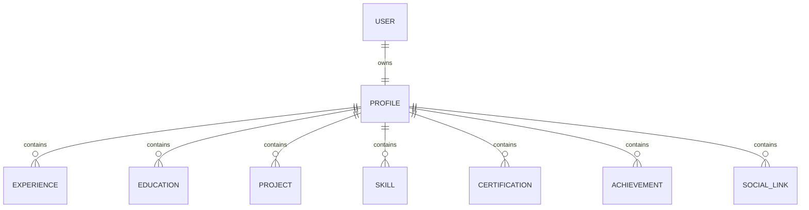

# Entity Relationship Diagram

The diagram is the canonical cardinality reference for the Phase 3.1 entities. `||` denotes exactly one and `o{` denotes zero or more.

## Relationship explanations

| Relationship | Meaning |
| --- | --- |
| User 1:1 Profile | The sole administrator account owns exactly one professional identity. Profile is not an account record. |
| Profile 1:N Experience | A profile may have no experience entries initially and can own many over time; each entry belongs to exactly one profile. |
| Profile 1:N Education | A profile may list many educational records; each record has one profile owner. |
| Profile 1:N Project | A profile may expose many portfolio projects; each project belongs to one profile. |
| Profile 1:N Skill | A profile may present many skills; each skill belongs to one profile. |
| Profile 1:N Certification | A profile may present many credentials; each certification belongs to one profile. |
| Profile 1:N Achievement | A profile may present many achievements; each achievement belongs to one profile. |
| Profile 1:N SocialLink | A profile may publish many external links; each link belongs to one profile. |

The diagram intentionally contains no many-to-many relationships, role tables, technology entities, or media relationships. They are outside this approved phase.
